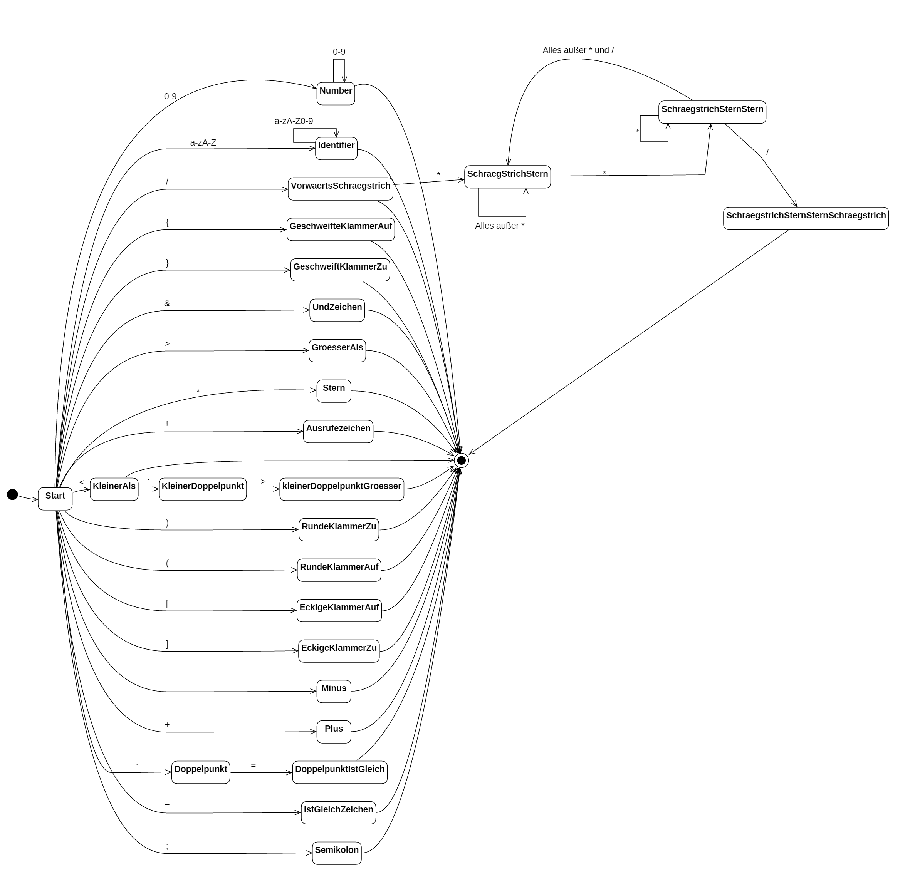

Dokumentation "systemnahes Programmieren" 
==============================================================

Teil 1: Der Scanner
==================
*Ein Projekt von Dennis Kühnen, Marius Wirtherle und Marvin Rühe*

Aufgabe
------
Die Aufgabe dieses Teils der systemnahen Programmierübung ist es einen Scanner für eine erfundene Programmiersprache zu bauen. Diese Sprache erklären wir im nächsten Abschnitt.

Die Bearbeitung dieser Aufgabe soll in C++ erfolgen. Dabei sollen jedoch keine fertigen Datenstrukturen verwendet werden.

Der Scanner soll aus drei Teilen bestehen: Einem Buffer der die Quelltextdatei einliest, einem Automat der Tokens aus diesem Text erstellt und einer Symboltabelle in der Informationen über diese Tokens gespeichert werden.

Die Sprache
-----------
Die Programmiersprache dieser Aufgabe ist als regulärer Ausdruck gegeben: 

```
digit ::= 0 | 1 | 2 | 3 | 4 | 5 | 6 | 7 | 8 | 9
letter ::= A | B | C | ... | Z | a | b | ... | z

sign... ::= + | - | / | * | < | > | = | := |<:> | ! | & | ; | ( | ) | { | } | [ | ]
integer ::= digit digit*
identifier ::= letter (letter | digit)*
if ::=if |IF
while ::= while | WHILE
```

Whitespace-Zeichen wie Leerzeichen, Tabs oder Zeilenumbrüche zwischen den Worten sind nicht notwendig, aber erlaubt.

Kommentare beginnen mit `/*` und enden mit `*/` oder beim Dateienden. Innerhalb eines Kommentars darf alles stehen, außer `*/`. Kommentare dürfen nicht geschachtelt werden. Sie werden nicht als Token erfasst und trennen Worte. 

Im zweiten Teil wird diese Definition um weitere Bezeichner erweitert und es wird eine Grammatik hinzugefügt.

Diese Sprache wird in unserem Compiler von der Automaten Klasse implementiert, die wir weiter unten beschrieben haben.

Buffer
------
### Anforderung
Der Buffer wird zum einlesen von Dateien in unser Programm verwendet. Er verwendet die systemnahe Funktion `open`  um Dateien von der Festplatte zu lesen.
Besonders hardwarenah arbeitet diese Funktion wenn man das `O_Direct` Flag setzt. Dieses Flag mussten wir in dieser Aufgabe setzen.
Dadurch erfolgt das Lesen ungepuffert und es können nur ganze Blöcke von der Festplatte gelesen werden. Ein Block ist in der Regel 512 Byte groß und in einer einfachen ASCII-Textdatei wird ein Zeichen als ein Byte abgespeichert. Daher werden mit jedem Block immer 512 Zeichen gleichzeitig eingelesen.

Unser Programm muss daher das Puffern des Einlesens selber vornehmen und kann sich nicht auf das Betriebssystem verlassen. Er ermöglicht es dem Automaten die Quelldatei zeichenweise auszulesen und dabei auch Zeichenweise zurück zuspringen. 

### Implementierung
Der Konstruktor der Buffer-Klasse erwartet einen char* auf den Pfad an dem sich die Datei die gelesen werden soll befindet. 

Der Buffer hat drei öffentliche Methoden: 

1. `char getChar()`  
2. `void ungetChar()` 
3. `bool hasCharLeft()` 

zu 1. ) Die Methode `getChar` liefert das nächste Zeichen der Datei zurück. Wenn man also zwei mal hintereinander `getChar()` aufruft werden die ersten beiden Zeichen einer Datei zurückgegeben. 

zu 2. ) Die Methode `ungetChar` setzt die Position in der Datei von der wir aktuell lesen um ein Zeichen zurück. Vorsicht: Das bedeutet, wenn man `getChar(); ungetChar(); getChar()` aufruft wird zwei mal das selbe Zeichen gelesen. 

zu 3. ) Die Methode `bool hasCharLeft();` Überprüft ob das Zeichen das mit dem nächsten `getChar()` gelesen werden würde das Ende der Datei ist, dass bedeutet die Methode überprüft ob es noch weitere Zeichen in der Datei gibt, die wir noch nicht gelesen haben. 

### Beschreibung
Der Datei Zugriff nutzt `read` und `O_DIRECT`, die drei entscheidenden Zeilen sind: 

    fileHandle = open(input_path, O_RDONLY | O_DIRECT); // um die Datei zu öffnen 
    posix_memalign((void**) &current_buffer, 512, 512); // um Speicher zu reservieren  
    read(fileHandle, current_buffer, 512); // um einen Block zu lesen 

Mit diesen drei Zeilen können wir jeder Zeit einen Block aus der Datei lesen. 

In der ersten Zeile öffnen wir die Datei im read-only modus. Durch das `O_Direct` können immer nur ganze Festplattenblöcke gelesen werden.
Für den Lesevorgang wird ein Stück Speicher benötigt, das an einer durch 512 teilbaren Startadresse beginnt. Das holen wir uns durch den aufruf von `posix_memalign` in der zweiten Zeile.
Die `read` Funktion liest dann aus der Datei einen Festplattenblock in den Puffer. In der Regel hat ein Festplattenblock 512 Byte. 

Intern wird der Buffer in zwei Teile aufgeteilt: `current_buffer` und `prev_buffer` Anfangs wird der `current_buffer` mit 512 Zeichen aus der Datei gefüllt und der Positionsindex `position` steht auf 0. 

Wenn jetzt `getChar` aufgerufen wird, wird `position` um eins erhöht und das Zeichen an der Stelle im `current_buffer` zurückgegeben an der `position` vorher stand.  
Mit der Methode `ungetChar()` wird einfach `position` um eins verringert. 

Die Methode `hasCharLeft()`, ruft einfach `getChar()` auf, schaut ob das nächste Zeichen ein Dateiende-Zeichen ist (`\0`) und ruft dann `ungetChar()` auf um die Position wiederherzustellen. 

Die beiden speziellen Fälle sind: Wenn man am Ende eines Blockes angekommen ist muss mehr aus der Datei nachgeladen werden und wenn man über die Blockgrenzen hinweg `ungetChar()` aufruft. 

Zum ersten Fall wenn mehr Daten gebraucht werden (d.h. das 513 Zeichen aus einem Block), dann müssen neue Daten aus der Datei gelesen werden, dass machen wir so: 

Der Inhalt des `current_buffer` wird in den `prev_buffer` verschoben. Das ist sehr einfach, weil nur die Pointer auf die Speicherstellen getauscht werden müssen. Dann wird wie schon am Anfang in `current_buffer` ein neuer Block der Datei eingelesen. Die Position wird auf 0 gesetzt. 

Wenn also direkt nachdem wir neue Daten gelesen haben ein `ungetChar()` kommt steht die `position` auf -1. Unsere `getChar()` Methode gibt wenn `position < 0` ist das Zeichen aus dem `prev_buffer` zurück an der Stelle `511+postion`. Also wenn `position = -1` ist, wird `prev_buffer[511-1]` zurückgegeben. 

Automat
------
### Anforderungen
Ziel des Automaten ist es, nach den Regeln der Programmiersprache den Quelltext in einzelne Tokens zu teilen. 
Wenn man dem Automaten ein Zeichen übergibt, ändert er seinen internen Zustand und zählt Zeilen und Spalten.

### Zustandsdiagramm

Da die Sprache die wir weiter oben beschrieben haben als regulärer Ausdruck gegeben ist, kann man diese in einen Endlichen-Automaten umbauen. 
Diesen Automaten haben wir in dieser Klasse implementiert:



### Implementierung
Es wird ein enum mit allen Zuständen die der Automat einnehmen kann definiert, `State`

    enum State {
		Undefined,
		Start,
		Number,
		Identifier,
		KleinerAls,
		GeschweifteKlammerAuf,
		GeschweifteKlammerZu,
		VorwaertsSchraegstrich,
		EckigeKlammerAuf,
		EckigeKlammerZu,
		UndZeichen,
		GroesserAls,
		Stern,
		Ausrufezeichen,
		RundeKlammerAuf,
		RundeKlammerZu,
		IstGleichZeichen,
		Minus,
		Plus,
		Doppelpunkt,
		DoppelpunktIstGleich,
		Semikolon,
		KleinerDoppelpunkt,
		kleinerDoppelpunktGroesser,
		SchraegStrichStern,
		SchraegstrichSternStern,
		SchraegstrichSternSternSchraegstrich,
		Fehler
    };

Seine öffentlichen Methoden sind:

1. `State getlastFinalState();`
2. `int getStepsSinceLastFinalState();`
3. `bool testChar(char c)`
4. `int getZeile();`
5. `int getSpalte();`

zu 1.) Gibt den letzten finalen Zustand des Automaten zurück. Wenn noch kein Finaler Zustand erreicht wurde wird der Zustand `Start` zurückgegeben.

zu 2.) Gibt die Anzahl der Zeichen, die getestet (`testChar()`) wurden, seit dem letzten finalen Zustand des Automaten zurück.

zu 3.) Die wichtigste Methode des Automaten: Sie führe die Übergänge der Zustände mit einem eingegeben Zeichen aus. Außerdem sorgt Sie dafür, dass Zeile und Spalte gezählt wurden.

zu 4. und 5.) Geben die Zeile und Spalte vom Anfang des Tokens zurück. (Ein neues Token beginnt wenn der Automat im Start Zustand ist und ein Zeichen getestet werden soll.)

### Beschreibung
Unser Automat basiert auf einer großen Übergangsmatrix (28x256), die aus die aus dem aktuellen Zustand (28 Verschiedene möglich) und einem beliebigen char (theoretisch 256 Verschiedene) einen Folgezustand zurückgibt.

Anfangs sind alle Übergänge mit `Undefined` als Folgezustand definiert, außer den Übergängen die bewusst im Konstruktor gesetzt wurden. 
Die erlaubten Übergänge sieht man in dem Zustandsdiagramm oben.

Ein zweites Array finalStates ordnet jedem Zustand zu, ob dieser ein finaler Zustand ist.

Mit dieser Information kann man jetzt für jedes Zeichen testen ob der Übergang `Undefined` ist oder ob es einen Folgezustand gibt.
Wenn der Übergang `Undefined` ist, wird false zurückgegeben, dies ist dann das Ende des Tokens. Ist der Folgezustand aber nicht `Undefined`, wird der aktuelle Zustand verändert und true zurückgegeben.

Scanner
-------

### Anforderung
Der Scanner baut die einzelnen Teile zusammen und steuert den Datenaustausch.
Der Scanner bekommt im Konstruktor den Pfad einer Eingabedatei. Diese Datei wird mit jedem Aufruf von nextToken um ein Token ausgelesen und dieses Token zurückgegeben.

### Implementierung
Der Scanner hat die Methode `bool nextToken(Token* t)` und die Methode `Information* getInfo(uint16_t key)`

Die Methode `nextToken` ließt solange Zeichen aus dem Buffer bis ein Token zusammengebaut werden kann und verknüpft dieses Token dann mit der Symboltabelle.
Um diese Methode aufzurufen erstellt man ein leeres Token und übergibt einen Pointer darauf an die `nextToken`-Methode. Nach dem Aufruf wurde das leere Token dann "ausgefüllt".
Wenn man am Ende der Datei ist und daher kein Token mehr gebaut werden kann, wird false zurückgegeben, sonst true.

Die Methode `getInfo` gibt zu einem übergebenen Schlüssel die entsprechende Information aus der Symboltabelle zurück.

### Beschreibung
Im Konstruktor des Scanners wird ein neuer Buffer mit dem übergebenen Dateipfad erstellt, außerdem wird ein neuer Automat und eine neue Symboltabelle erstellt.
Solange das eingegebene Token noch leer ist, und kein Kommentar, wird nach dem nächsten Token gesucht. Dazu wird wie folgt vorgegangen:

Es wird immer ein Zeichen aus dem Buffer geladen, dieses Zeichen wird in einer Liste gespeichert, dann wird es in den Automaten gegeben. 
Die Liste wird weiter unten dokumentiert.
Es werden solange Zeichen aus dem Buffer in den Automaten geschoben, bis der Automat kein weiteres Zeichen möchte, da er im Endzustand ist.
Dann wird der letzten Finale Zustand des Automaten im Token gespeichert. Es wird zusätzlich so viele Zeichen wieder zurückgesprungen wie seit dem letzten Finalen Zustand in den Automaten gegeben wurden, wenn nach dem letzten Finalen Zustand noch weitere Zeichen gelesen wurden.
Danach wird im Token die Zeile und Spalte die der Automat gezählt hat gespeichert.
Jetzt wird noch mit Hilfe der privaten Methode `makeInfo(Token* t)` das Token in die Symboltabelle eingefügt.
Am Ende wird zurückgegeben, ob der Buffer noch weitere Zeichen hat. 

### Die Methode `makeInfo`
Wandelt den TokenTyp (letzter Automatenzustand) im Token in einen InfoTyp um. State::Number wird zu InfoTyp::Integer, State::Identifier wird zu InfoTyp::Identifier, State::Fehler wird zu InfoTyp::Fehler, und die Zustände die ein Zeichen sind werden zu InfoTyp::Sign.

Mit der newInfo Methode der Symboltabelle wird jetzt der Inhalt des Tokens und dessen InfoTyp gespeichert und zurück wird ein Key gegeben mit dem man später wieder auf die Information zugreifen kann. 
Zur Kontrolle wird dann überprüft ob der Wert des Tokens ungleich -1 ist, das würde auf eine Bereichsüberschreitung hinweisen, dann wird der Typ auf Fehler gesetzt.

Abschließend wird noch der Key im Token gespeichert.

### Die Liste
### Anforderung
Um Buchstaben für den Token Inhalt bequem in einer Liste speichern zu können, von deren Ende man Buchstaben auch wieder entfernen kann, haben wir unsere Liste gebaut. Das macht natürlich nur Sinn wenn man weiß, dass wir keine fertigen Datenstrukturen verwenden dürfen.

### Implementierung
Die Öffentlichen Methoden unserer Liste sind:
1. `void push(char ch)`
2. `char pop()`
3. `char* getString()`
4. `bool isEmpty()`
5. `void clear()`

Die Liste ist eigentlich nicht als Liste implementiert, sondern als automatisch wachsendes Array. Sie verhält sich aber nach außen wie eine Liste.

Mit `push` wird an die Stelle des internen Zählers ein neues Zeichen geschreiben. Der Zähler wird um eins erhöht und an die Stelle, an der der Zähler dann steht, wird `\0` eingefügt. 

Probleme gibt es nur, wenn das aktuelle Array nicht groß genug ist:
In diesem Fall wird doppelt so viel Speicher wie das Array im Moment belegt angefordert und der Inhalt des aktuellen Arrays in das neue Array kopiert. Dann wird das alte Array gelöscht und durch das neue Array ersetzt.

Die Methode `pop` gibt das letzte Zeichen zurück und überschreibt seine Position vorher mit `\0`.

Die Methode `getString` gibt einfach einen Pointer auf das erste Element zurück, da wir immer am Ende des benutzen Bereichs des Arrays ein `\0` einfügen. `isEmpty` ist ebenfalls trivial: wir verwenden einen internen Zähler der einfach mit 0 verglichen wird.
`clear` setzt den internen Zähler wieder auf 0 und fügt an der ersten Stelle im Array ein `\0` ein.

Im Konstruktor wird eine leere Liste angelegt mit Platz für 8 Zeichen.
Im Destruktor wird der Speicherplatz der Liste immer wieder freigegeben.


Token
-----
### Anforderung
Der Quelltext der vom Buffer eingelesen wird, soll im Scanner in Tokens aufgespalten werden. Diese Tokens haben Zeilen und Spalten Information, sowie einen Typen, einen Inhalt und einen Key. Mit dem Key kann man dann die Information die mit diesem Token verbunden ist in der Symboltabelle abrufen.

### Implementierung
Für Zeile und Spalte gibt es Getter und Setter (`int getZeile(), int getSpalte(), void setZeile(int Zeile), void setSpalte(int Spalte)`).
Für TokenTyp und Key ebenso (`State getTokenTyp(), void setTokenTyp(State t), void setKey(uint16_t key) und uint16_t getKey()`)

Der Inhalt des Tokens wird in einer Liste gespeichert. Der Inhalt sind die Zeichen aus dem Buffer, die dieses Token repräsentiert. Die Funktionsweise der Liste ist weiter oben beschrieben. Sie wird im Konstruktor angelegt und ist über die `content` Variable öffentlich zugänglich. Die Methode `char* getContent()` liefert die Liste als Zeichenkette zurück.

Zusätzlich hat ein Token noch die Methode `const char* getTokenTypeString()` das den aktuellen TokenTyp als Zeichenkettte für die Ausgabe zurückgibt. Ein TokenTyp ist ein enum und kann damit in ein Integer umgewandelt werden. Dieser wird als Index für ein Array mit den Namen der TokenTypen verwendet und der String zurückgegeben.

Symboltable
------
### Anforderung
Die Symboltabelle speichert die Informationen (Information wird weiter unten beschrieben) in einer Hashtabelle. Bei doppelten Hashwerten wird eine Linked List angelegt. Um auf die Informationen zuzugreifen wird ein Key benötigt, welcher in einer dynamischen Liste gespeichert wird.

### Implementierung
Der Konstruktor der Symboltable-Klasse erwartet keine Parameter. Er initialisiert die ürsprüngliche Größe der Keyliste und die Größe der Hashmap und er reserviert den Speicher für beide.

Die Symboltabelle hat drei öffentliche Methoden: 

1. `Information* getInfo(uint16_t key)`  
2. `uint16_t newInfo(char* lexem, InfoTyp t)` 
3. `uint16_t hash(char* ch)` 

zu 1. ) Die Methode `getInfo()` erwartet als Parameter den Key der Information, welche als `Information*` zurückgegeben werden soll. Wenn die Information nicht existiert wird `NULL` zurückgegeben.

zu 2. ) Die Methode `newInfo()` erwartet als Parameter das Lexem als `char*` und den Typ der Information Infotyp-enum(-> siehe Information-Dokumentation). Sie gibt den Key der zum Lexem gehörigen Information als `uint16_t` zurück. Wenn die entsprechende Information schon existiert, dann wird sie nicht neu angelegt, sondern lediglich der Key zurückgegeben.

zu 3. ) Der Hashwert der Informationen wird hier mithilfe des Lexems berechnet, indem die einzelnen Zeichen als `(uint16_t)` gecastet addiert werden und danach modulo der Hashmap-Größe. Als Parameter wird das Lexem als `char*` erwartet und als Rückgabewert erfolgt der Hashwert als `uint16_t`.

### Private Methoden und Attribute

`void keySizeBigger()`: Diese Methode wird immer dann aufgerufen, wenn eine neue Information angelegt wurde. Sie inkrementiert das Attribut `keysize`. Wenn die `keys`-Liste voll ist verdoppelt sie deren Größe und reserviert neuen Speicher.

`void initSymbols()`: Diese Methode wird vom Konstruktor der Symboltable aufgerufen und erzeugt Informationen für alle Schlüsselwörter der Sprache (if, else, while, int, read, write) mit dem entsprecenden Infotypen.

Als Speicher der Keys und der Informationen dienen die Arrays `Information** informations` und `int* keys`. Das Attribut `memsize` legt die Größe der Hashmap `informations` fest und `keysizemax` die momentane Größe des Speichers des `keys` Arrays. Das Attribut `keysize` zählt die tatsächliche Größe des `keys` Arrays mit.


Information
------

#### Anforderung
Die Klasse `Information` dient zum Speichern der Informationen in der Symboltabelle. Sie speichert das Lexem, den Key in der Symboltabelle, ihren `InfoTyp`, und ihren Wert für Zahlen.

### Implementierung

Der Konstruktor der Klasse erwartet als Parameter das Lexem der Information und den Key. Diese werden abgespeichert. Außerdem wird der Pointer auf die nächste Information auf `null` gesetzt. Der Zahlenwert wird mit -1 initalisiert und `type` wird auf `Unkown` gesetzt. 

`char* getLexem()`: Liefert das Lexem der Information zurück.

`void setLexem(char* lex)`: Ändert das Lexem zu dem Wert des Parameters.

`bool compareLexem(char* lex)`: Liefert `true` zurück, wenn das übergebene Lexem das gleiche ist wie das gespeicherte.

`Information* getNextInfo()`: Liefert das Attribut `nextInfo` zurück. Dieses wird von der Symboltabelle verwendet, wenn mehrere Informationen den selben Hash haben.

`void setNextInfo(Information* info)`: Ändert das Attribut `nextInfo` zu dem Wert des Parameters.

`uint16_t getKey()`: Liefert den Key der Information zurück.

`int getValue()`: Liefert den Inhalt des Tokens als Integer konvertiert zurück. Beim ersten Aufruf wird dieser berechnet. Wenn eine Berechsüberschreitung (x < 0 oder x > `INT_MAX`) vorliegt, dann wird der Wert -1 zurückgegeben.

`InfoTyp getType()`: Liefert den Typ der Information als `InfoTyp`-enum zurück.

`void setType(InfoTyp t)`: Ändert den Wert des Typs der Information.

## Attribute

`InfoTyp type`: Der Typ der Information: (Standartwert Unknown)

```
enum class InfoTyp{
	Unknown,
	Sign,
	Integer,
	Identifier,
	iftyp,
	whiletyp,
	elsetyp,
	inttyp,
	writetyp,
	readtyp,
	Fehler
};
```

`char* lexem`: Das Lexem der Information.

`Information* nextInfo`: Bei doppeltem Hashwert in der Symboltabelle wird hiermit die LinkedList realisiert. (Standartwert `NULL`)

`uint16_t key`: Der Key der Information in der Symboltabelle.

`int value`: Das Lexem als Integer. (Standartwert -1)

ScannerTest
-----------
Die Klasse ScannerTest wird verwendet um das Programm auszuführen. Sie enthält eine `main` Methode. Als Kommandozeilen Argumente werden die Pfade zur Quellcodedatei und der Ausgabedatei übergeben.
```
./ScannerTest in.txt out.txt
```

In der Main Funktion wird solange die Methode `nextToken` aufgerufen, bis die komplette Datei verarbeitet ist.

In die Ausgabe Datei wird eine Liste der Tokens geschrieben. Auf der Konsole werden Fehler ausgegeben.
